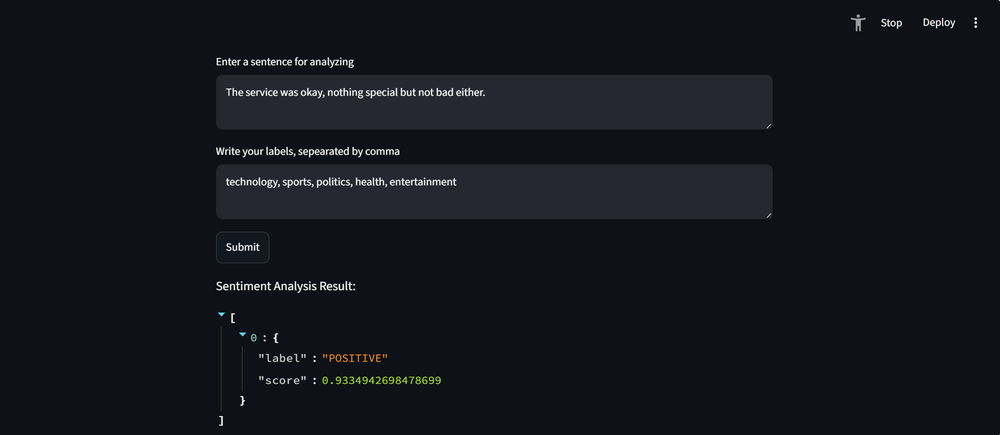
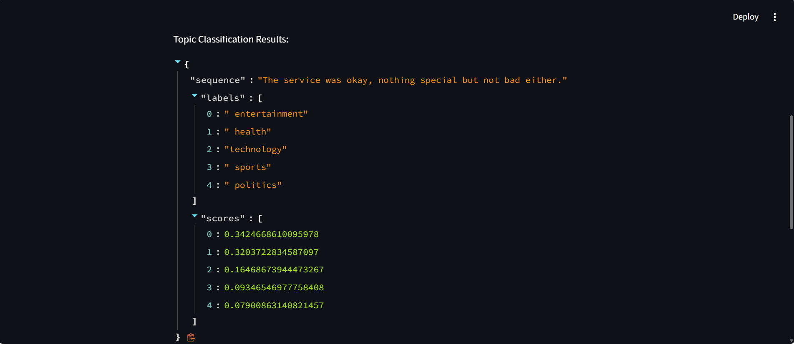
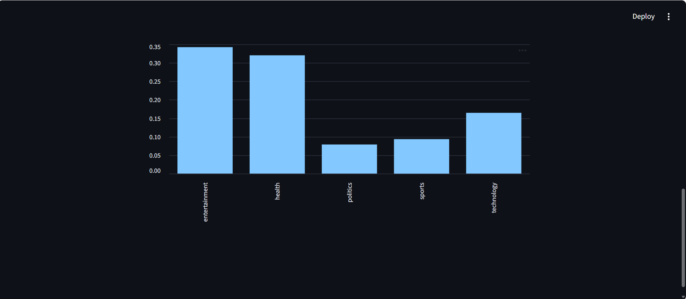
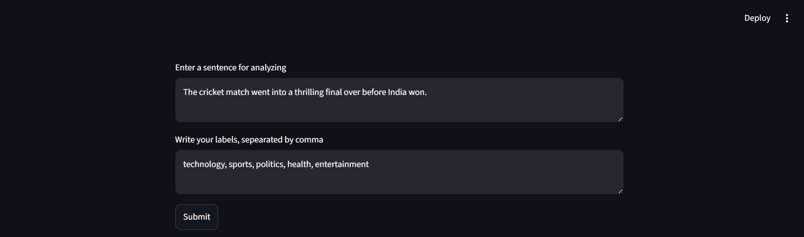
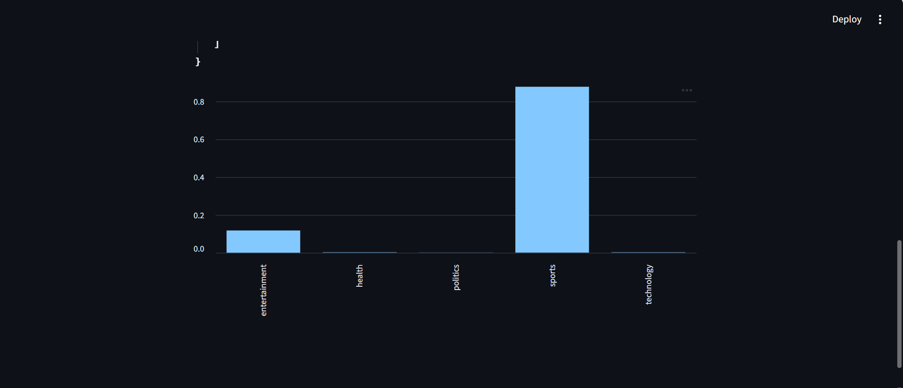
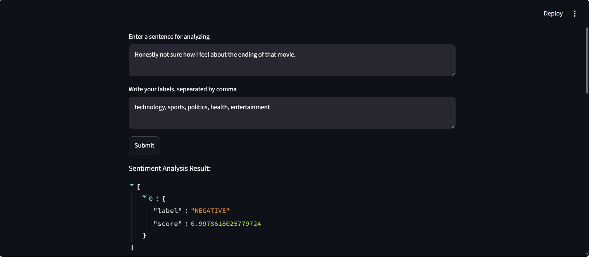

# Hugging Face Sentiment & Topic Classifier

## Overview

This project performs both sentiment analysis and topic classification using pre-trained Hugging Face models. The functionality is wrapped inside an interactive Streamlit web application that allows users to enter text and instantly receive predictions along with visualizations.

The application demonstrates how transformer based NLP models can be integrated into a user-friendly interface for real-time text analysis.

---

## Features

* Sentiment Analysis (Positive / Negative)
* Confidence scores for predictions
* Zero-shot topic classification
* Interactive Streamlit interface
* Graphical visualization of model outputs
* Support for custom topic labels

---

## Tech Stack

* Python
* Hugging Face Transformers
* PyTorch
* Streamlit
* Pandas
* Matplotlib

---

## Models Used

This project utilizes two pre-trained Hugging Face models:

### Sentiment Analysis

* **distilbert-base-uncased-finetuned-sst-2-english**
* Model Link: https://huggingface.co/distilbert/distilbert-base-uncased-finetuned-sst-2-english

### Topic Classification (Zero-Shot)

* **facebook/bart-large-mnli**
* Model Link: https://huggingface.co/facebook/bart-large-mnli

These models are loaded through the Hugging Face Transformers library and used to perform sentiment analysis and zero-shot topic classification on user-provided text.

---

## How It Works

### Sentiment Analysis

The application predicts whether the entered text expresses a **POSITIVE** or **NEGATIVE** sentiment. Along with the prediction, it displays confidence scores.

### Topic Classification

Using zero-shot classification, the application categorizes text into user-defined topics without requiring additional model training. The predicted topics and their confidence scores are displayed in both textual and graphical formats.

---

## Project Structure

```text
project/
│
├── app.py
├── requirements.txt
├── README.md
│
└── screenshots/
    ├── service_senti.png
    ├── service_labels.png
    ├── service_graph.png
    ├── cricket_eg.png
    ├── cricket_graph.png
    └── movie_senti.png
```

---

## How to Run Locally

### 1. Clone the Repository

```bash
git clone <https://github.com/vitistatyagi/Sentiment_Classifier.git>
cd Sentiment_Classifier
```

### 2. Create and Activate a Virtual Environment

```bash
python -m venv .venv
```

Windows:

```bash
.venv\Scripts\activate
```

Mac/Linux:

```bash
source .venv/bin/activate
```

### 3. Install Dependencies

```bash
pip install -r requirements.txt
```

### 4. Launch the Streamlit App

```bash
streamlit run app.py
```

The application will open automatically in your browser.

---

## Example Outputs

### Example 1: Sentiment Analysis

Input:

> "The service was okay, nothing special but not bad either."

Result:

* Predicted Sentiment: POSITIVE
* Confidence Score: ~93.3%

This example demonstrates how the model assigns a sentiment label along with confidence scores and visualizes the prediction through charts.







---

### Example 2: Topic Classification

Input:

> "The cricket match went into a thrilling final over before India won."

Result:

* Sports: 0.876
* Entertainment: 0.117
* Health: 0.003
* Technology: 0.003
* Politics: 0.001

The model correctly identifies the text as sports-related with high confidence while assigning lower probabilities to unrelated categories.





---

## Limitations

The sentiment model used in this project is trained only on two labels:

* POSITIVE
* NEGATIVE

As a result, text expressing neutral, mixed, or ambiguous emotions may still receive a highly confident positive or negative prediction.

For example:

> "Honestly not sure how I feel about the ending of that movie."

The model predicts:

* NEGATIVE
* Confidence Score: ~99.7%

This behavior is a limitation of the underlying sentiment model rather than the Streamlit application itself.



---

## What I Learned

Through this project, I gained hands-on experience with:

* Hugging Face Transformers
* Pre-trained NLP models
* Sentiment analysis pipelines
* Zero-shot classification
* Streamlit application development
* Model confidence score visualization
* Integrating machine learning models into user-facing applications

I also learned how to deploy transformer-based NLP workflows in an interactive environment while keeping the implementation lightweight and easy to use.

---
